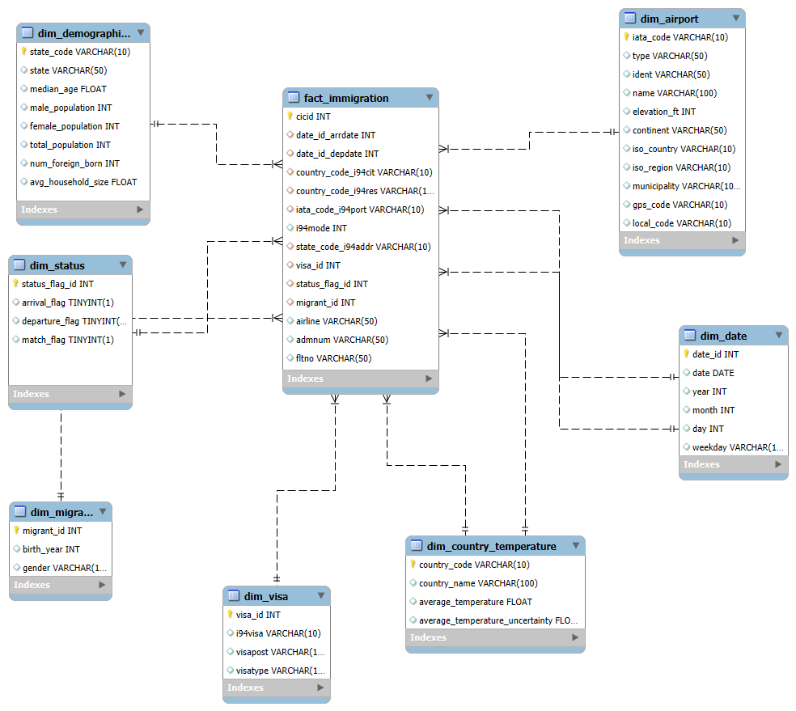

## Data Engineering Capstone Project

## Contents

+ [Problem Summary](#Problem-Summary)
+ [Project Datasets](#Project-Datasets)
+ [Project Outline](#Project-Outline)
+ [Data Model](#Data-Model)
+ [Project Structure](#Project-Structure)
+ [ETL Steps](#ETL-Steps)
+ [Usage](#Usage)

## Project Summary
The objective of this project is to conduct a study on Immigration Data of the United States with regards to World Temperature Data, U.S. City Demographic Data, and Airport Code Data that is made available by Udacity to answer questions such as, what is the proportion of immigrants to the U.S from countries with cooler weather? among other analytics requests..

The goal is to create ETL pipelines that extract each dataset from the provided data sources, apply the required levels of transformation, and then load the cleaned data into an analytics database (data warehouse) with a new consolidated data model that serves the analysis and study needs.

## Project Datasets
Udacity has provided the following Datasets for this project:
- **I94 Immigration Data:** This data comes from the US National Tourism and Trade Office. [This](https://travel.trade.gov/research/reports/i94/historical/2016.html) is where the data comes from. There's a sample file so you can take a look at the data in csv format before reading it all in.
- **World Temperature Data:** This dataset came from Kaggle. You can read more about it [here](https://www.kaggle.com/berkeleyearth/climate-change-earth-surface-temperature-data).
- **U.S. City Demographic Data:** This data comes from OpenSoft. You can read more about it [here](https://public.opendatasoft.com/explore/dataset/us-cities-demographics/export/).
- **Airport Code Table:** This is a simple table of airport codes and corresponding cities. It comes from [here](https://datahub.io/core/airport-codes#data).

## Project Outline
The project follows the following steps:
* Step 1: Scope the Project and Gather Data
* Step 2: Explore and Assess the Data
* Step 3: Define the Data Model
* Step 4: Run ETL to Model the Data
* Step 5: Complete Project Write Up

## Data Model
Using the mentioned datasets, we have mapped out a conceptual data model concerning immigration data and its different dimensions as follows:

The data model here represents immigration instances with regard to airport data, demographic data, temperature data, and others. The model is designed as a **Star schema** in the data warehouse, where the desired immigration facts and info are in the fact table, and other perspective information and features that include an object in the fact table are dimension tables.

The star schema is suitable for the analytics purposes of immigration study, since it connects relevant information within a proper number of aggregations and links (fewer joins), and decreases the records duplication at an adequate level with respect to schema complexity.

**Fact table:**
- Immigration table

**Dimension tables:**
1. Migrant
1. Status
1. Visa
1. Demographics
1. Airport
1. Country Temperature
1. Date

## Project Structure
The project structure is shown as the following:
- `capstone_project.ipynb`: is where the project steps are implemented.
- `clean_tables.py`: contains functions that clean the project datasets.
- `schema_tables.py`: contains functions that create the proposed data model tables.
- `utils.py`: contains different functions for utilization.
- `I94_SAS_Labels_Descriptions.SAS`: immigration data label mapping.
- `data_dictionary.md`: data dictionary for the proposed data model.
- `conceptual_data_model.png`: diagram of the conceptual data model.
- `data`: folder contains some of the project datasets.
- `README.md`: provides discussion about the project.

## ETL Steps
ETL performs following steps to ingest, clean and save the data:
- Load I94 immigrations dataset and US immigrations dataset.
- Load Ports, Country, Visa Category, Travel Mode and US states dataframes using `I94_SAS_Labels_Descriptions.SAS` file parsing.
- Clean immigrations data by normalizing arrival/departure SAS format dates, excluding invalid years from birth year column and dropping duplicates.
- Demographics data is already clean so just dropping duplicates.
- Ports data is further cleaned by splitting port name into city name and state code.
- Clean Country and States dataframes by excluding incorrect values.
- Create immigrations fact table by joining ports, visa category, country, travel mode and us state dimensions valid data.
- Create city demographics data by combining ports and US demographics valid data.
- Perform data quality checks by checking that each table/dataframe has data inside it.
- Save dataframes in Parquet format.

## Usage
To work on this project, you need first to install Python in your machine. Then, install the following dependencies:
- [Spark](https://spark.apache.org/)
- [Pandas](https://pandas.pydata.org/)
- [Matplotlib](https://matplotlib.org/)
  
You can use also:
- [Airflow](https://airflow.apache.org/)
- [AWS Services](https://aws.amazon.com/)

